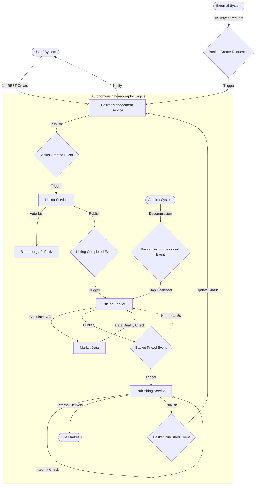
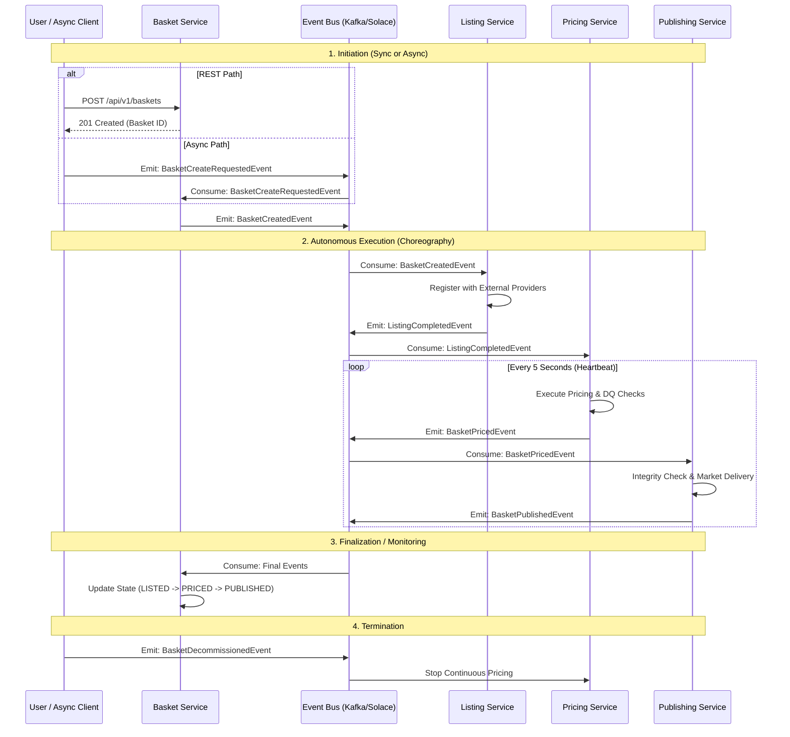
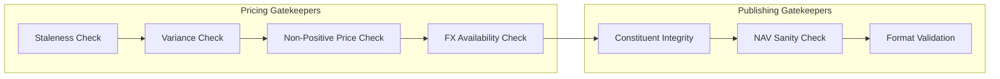
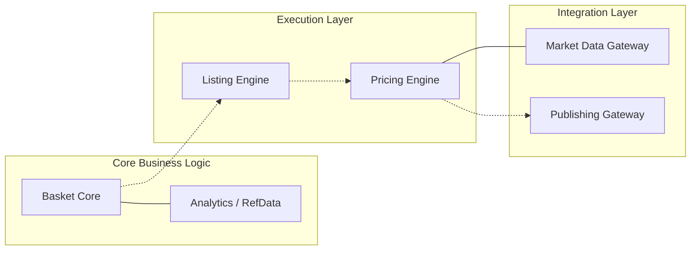
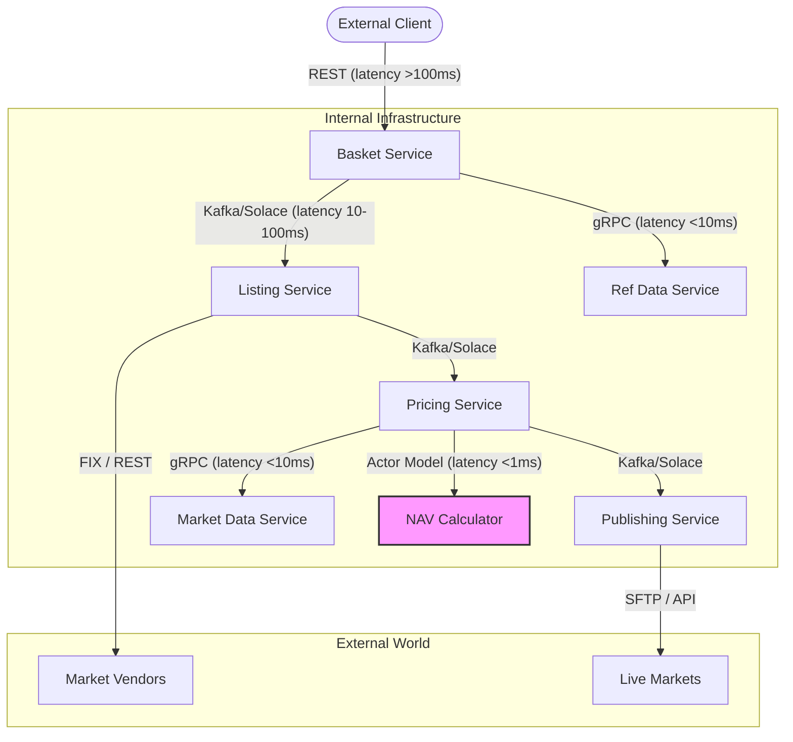

# Architecture Visuals: Custom Index Lifecycle

This document provides a visual representation of the **Custom Index Listing & Pricing Suite** workflow and service interactions.

## 1. High-Level Flow Diagram (The Business Process)
This diagram shows the logical progression of an index from its initial draft to its final published state, including the continuous pricing loop and the asynchronous creation entry point.

## 2. High-Level Sequence Diagram (Service Interactions)
This diagram illustrates how the services communicate asynchronously via the Event Bus (Kafka/Solace) and the continuous update cycle.

## 3. Data Quality (DQ) Gatekeepers
The platform implements multiple "Gatekeeper" checks to ensure that only accurate data reaches external markets.

## 4. Component Architecture & System Boundaries
This interaction diagram highlights the core components and how they interact logically within the platform.

## 5. Hybrid Communication & Protocol Strategy
Following the **Smart Communication Router** strategy [[memory:6883576]], this diagram shows the specific protocols used between components based on latency and business context.

## 6. Key Architectural Principles
*   **Choreography (Not Orchestration)**: No single service "controls" the workflow. Services react to events, making the system more resilient and easier to scale.
*   **Event-Driven**: Communication is asynchronous. If one service is temporarily offline, the events are queued and processed as soon as it recovers.
*   **State-Aware**: The Basket Service tracks the aggregate state, providing a single source of truth for the User while the work happens in parallel.
*   **Smart Communication**: Protocol selection is driven by latency requirements (REST > Event Bus > gRPC > Actor Model).
*   **Root-Level Divisor**: The `divisor` is treated as a first-class attribute of the Index (Basket level) rather than an instrument property, ensuring consistent scaling of the index price.