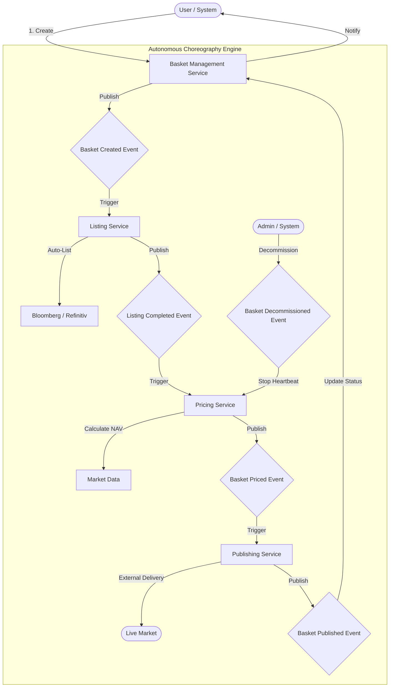
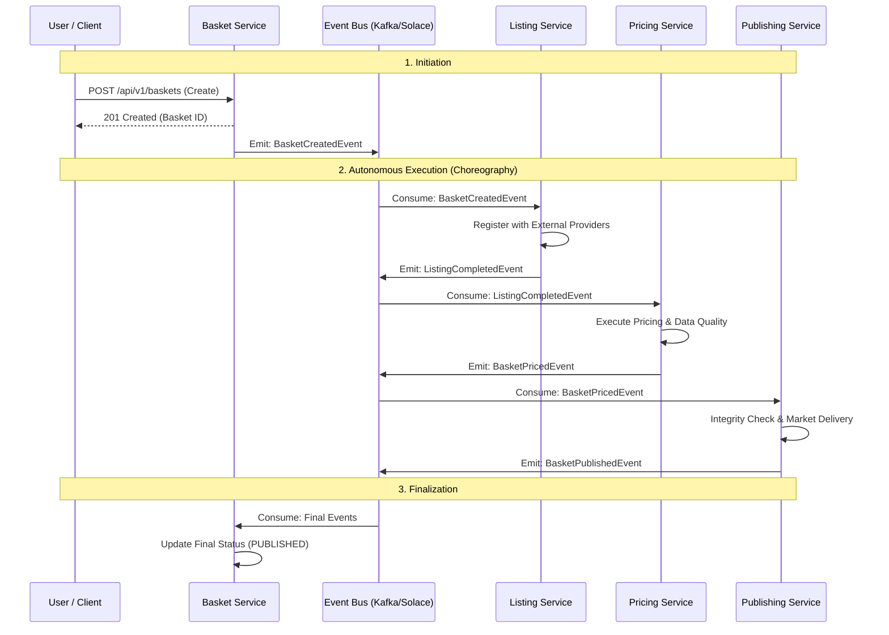

# Architecture Visuals: Custom Index Lifecycle

This document provides a visual representation of the **Custom Index Listing & Pricing Suite** workflow and service interactions.

## 1. High-Level Flow Diagram (The Business Process)
This diagram shows the logical progression of an index from its initial draft to its final published state in the market.

## 2. High-Level Sequence Diagram (Service Interactions)
This diagram illustrates how the services communicate asynchronously via the Event Bus (Kafka/Solace) to ensure high availability and resiliency.

## 3. Component Architecture & System Boundaries
This interaction diagram highlights the core components and how they interact logically within the platform.

## 4. Hybrid Communication & Protocol Strategy
Following the **Smart Communication Router** strategy [[memory:6883576]], this diagram shows the specific protocols used between components based on latency and business context.

## 5. Key Architectural Principles
*   **Choreography (Not Orchestration)**: No single service "controls" the workflow. Services react to events, making the system more resilient and easier to scale.
*   **Event-Driven**: Communication is asynchronous. If one service is temporarily offline, the events are queued and processed as soon as it recovers.
*   **State-Aware**: The Basket Service tracks the aggregate state, providing a single source of truth for the User while the work happens in parallel.
