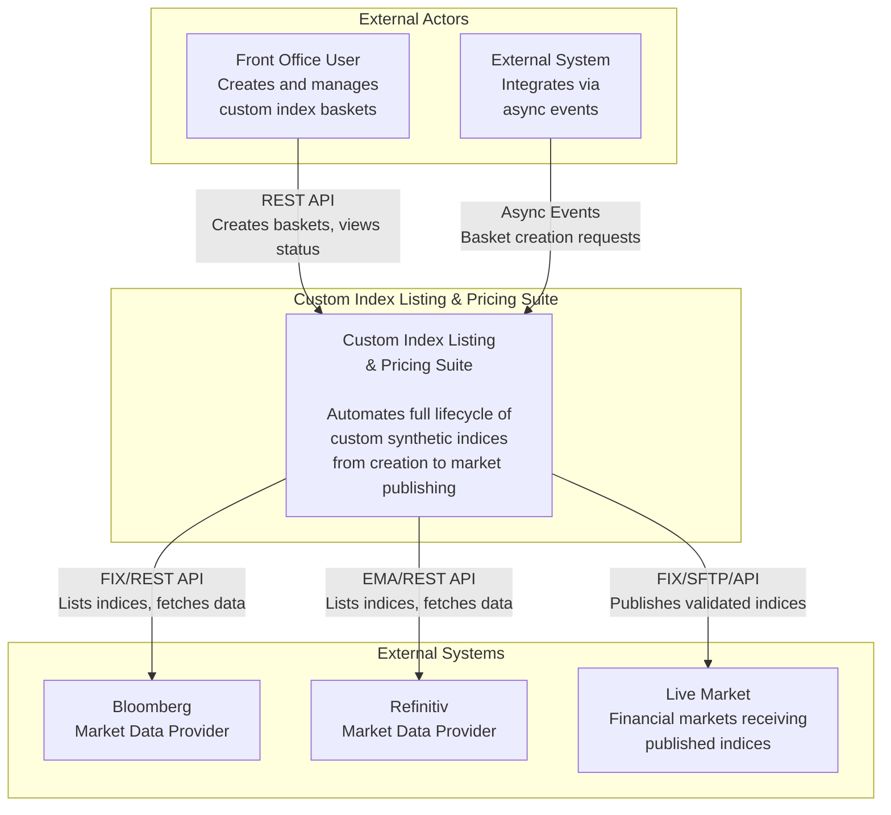
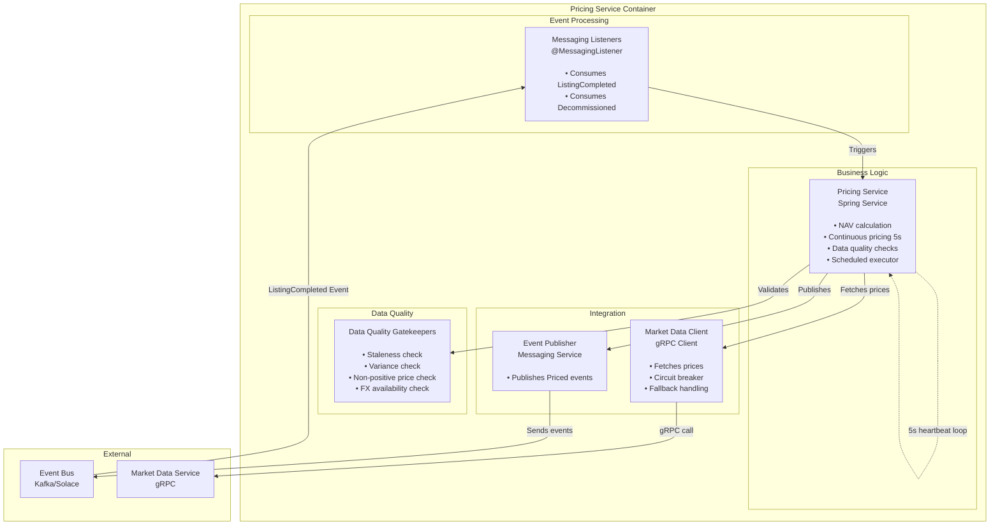
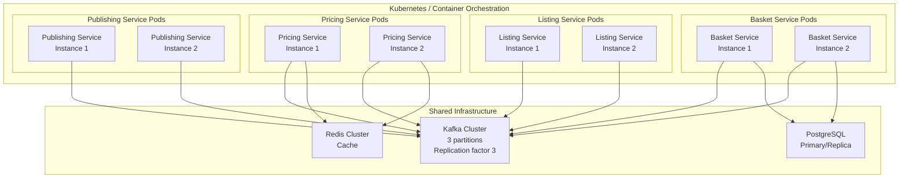

# C4 Model Architecture Diagrams

This document provides C4 model architecture diagrams for the Custom Index Listing & Pricing Suite, following the C4 model methodology for visualizing software architecture.

## C4 Model Overview

The C4 model consists of four levels:
1. **System Context (Level 1)**: Shows the system and its users
2. **Container (Level 2)**: Shows the high-level technical building blocks
3. **Component (Level 3)**: Shows the components within a container
4. **Code (Level 4)**: Shows classes/interfaces

---

## Level 1: System Context Diagram

Shows the Custom Index Listing & Pricing Suite system and how it interacts with users and external systems.



---

## Level 2: Container Diagram

Shows the high-level technical building blocks (containers) and how they interact.

```mermaid
graph TB
    subgraph Actors["External Actors"]
        User[Front Office User]
        ExtSys[External System]
    end
    
    subgraph AppServices["Application Services"]
        BasketSvc["Basket Service<br/>Java 21, Spring Boot<br/><br/>• Manages basket lifecycle<br/>• Versioning & rebalancing<br/>• CVT calculation<br/>• REST API"]
        ListingSvc["Listing Service<br/>Java 21, Spring Boot<br/><br/>• Registers baskets with providers<br/>• Fan-out to multiple providers<br/>• Event-driven"]
        PricingSvc["Pricing Service<br/>Java 21, Spring Boot<br/><br/>• Calculates NAV<br/>• Continuous pricing 5s<br/>• Data quality checks"]
        PublishingSvc["Publishing Service<br/>Java 21, Spring Boot<br/><br/>• Publishes to markets<br/>• Integrity validation<br/>• Provider-specific delivery"]
        MarketDataSvc["Market Data Service<br/>Java 21, Spring Boot<br/><br/>• Fetches prices & FX<br/>• Normalizes data<br/>• Caching & staleness checks"]
        RefDataSvc["Reference Data Service<br/>Java 21, Spring Boot<br/><br/>• Instrument validation<br/>• Eligibility rules<br/>• Golden source data"]
    end
    
    subgraph DataStores["Data Stores"]
        Postgres[("PostgreSQL Database<br/><br/>• Basket definitions<br/>• Constituents<br/>• Instructions<br/>• Audit events")]
        MSSQL[("MSSQL Database<br/><br/>• Primary production DB<br/>• Azure SQL Edge")]
        Cache[("Cache Layer<br/>Redis / Hazelcast<br/><br/>• Market data cache<br/>• Reference data cache<br/>• Pluggable providers")]
    end
    
    subgraph Infrastructure["Infrastructure"]
        EventBus["Event Bus<br/>Kafka / Solace<br/><br/>• Async event streaming<br/>• Broker-agnostic<br/>• Partitioning & DLQ"]
    end
    
    subgraph ExtSystems["External Systems"]
        Bloomberg[Bloomberg<br/>Market Data Provider]
        Refinitiv[Refinitiv<br/>Market Data Provider]
        Market[Live Market<br/>Financial Markets]
    end
    
    subgraph ObservabilityStack["Observability"]
        Observability[Prometheus<br/>OpenTelemetry<br/>Actuator]
    end
    
    %% Force vertical stacking for main flow (left side)
    Actors -.->|""| AppServices
    AppServices -.->|""| DataStores
    DataStores -.->|""| Infrastructure
    Infrastructure -.->|""| ExtSystems
    
    %% Position Observability on the right side (horizontal connection)
    DataStores -->|""| ObservabilityStack
    
    %% User interactions
    User -->|"REST API<br/>HTTPS"| BasketSvc
    ExtSys -->|"Async Events"| EventBus
    
    %% Basket Service interactions
    BasketSvc -->|"Read/Write"| Postgres
    BasketSvc -->|"Publish/Consume"| EventBus
    BasketSvc -->|"Validate instruments<br/>gRPC"| RefDataSvc
    BasketSvc -->|"Metrics & Health"| Observability
    
    %% Listing Service interactions
    EventBus -->|"BasketCreated Event"| ListingSvc
    ListingSvc -->|"Register index<br/>FIX Protocol"| Bloomberg
    ListingSvc -->|"Register index<br/>EMA/REST"| Refinitiv
    ListingSvc -->|"ListingCompleted Event"| EventBus
    ListingSvc -->|"Metrics & Health"| Observability
    
    %% Pricing Service interactions
    EventBus -->|"ListingCompleted Event"| PricingSvc
    PricingSvc -->|"Fetch prices<br/>gRPC"| MarketDataSvc
    PricingSvc -->|"Cache prices"| Cache
    PricingSvc -->|"Priced Event"| EventBus
    PricingSvc -->|"Metrics & Health"| Observability
    
    %% Publishing Service interactions
    EventBus -->|"Priced Event"| PublishingSvc
    PublishingSvc -->|"Deliver indices<br/>FIX/SFTP/API"| Market
    PublishingSvc -->|"Published Event"| EventBus
    PublishingSvc -->|"Metrics & Health"| Observability
    
    %% Market Data Service interactions
    MarketDataSvc -->|"Fetch prices<br/>REST API"| Bloomberg
    MarketDataSvc -->|"Fetch prices<br/>REST API"| Refinitiv
    MarketDataSvc -->|"Cache prices"| Cache
    MarketDataSvc -->|"Metrics & Health"| Observability
    
    %% Reference Data Service interactions
    RefDataSvc -->|"Cache data"| Cache
    RefDataSvc -->|"Metrics & Health"| Observability
    
    %% Styling
    classDef serviceClass fill:#e1f5ff,stroke:#0277bd,stroke-width:2px
    classDef dataClass fill:#fff3e0,stroke:#ef6c00,stroke-width:2px
    classDef infraClass fill:#f3e5f5,stroke:#7b1fa2,stroke-width:2px
    classDef extClass fill:#e8f5e9,stroke:#2e7d32,stroke-width:2px
    
    class BasketSvc,ListingSvc,PricingSvc,PublishingSvc,MarketDataSvc,RefDataSvc serviceClass
    class Postgres,MSSQL,Cache dataClass
    class EventBus,Observability infraClass
    class Bloomberg,Refinitiv,Market extClass
```

---

## Level 3: Component Diagram - Basket Service

Shows the components within the Basket Service container.

```mermaid
graph TB
    subgraph "Basket Service Container"
        subgraph "API Layer"
            RESTAPI[REST API Controller<br/>Spring MVC<br/><br/>• POST /api/v1/baskets<br/>• GET /api/v1/baskets/{id}<br/>• POST /api/v1/baskets/{id}/rebalance<br/>• GET /api/v1/baskets/{id}/versions]
        end
        
        subgraph "Business Logic"
            BasketService[Basket Service<br/>Spring Service<br/><br/>• Create/update baskets<br/>• Status management<br/>• Constituent validation]
            RebalanceService[Rebalance Service<br/>Spring Service<br/><br/>• Zero P&L rebalancing<br/>• CVT calculation<br/>• Version creation]
        end
        
        subgraph "Data Access"
            BasketRepo[Basket Repository<br/>Spring Data JPA<br/><br/>• CRUD operations<br/>• Version queries<br/>• Optimistic locking]
            InstructionRepo[Instruction Repository<br/>Spring Data JPA<br/><br/>• Rebalance audit trail<br/>• Instruction status]
        end
        
        subgraph "Integration"
            EventPublisher[Event Publisher<br/>Messaging Service<br/><br/>• Publishes events<br/>• Partition key extraction]
            MessagingListener[Messaging Listeners<br/>@MessagingListener<br/><br/>• Consumes events<br/>• Async processing]
        end
    end
    
    subgraph "External"
        EventBus[Event Bus<br/>Kafka/Solace]
        RefDataSvc[Reference Data Service<br/>gRPC]
        Postgres[("PostgreSQL")]
    end
    
    RESTAPI -->|"Delegates to"| BasketService
    RESTAPI -->|"Delegates to"| RebalanceService
    BasketService -->|"Reads/Writes"| BasketRepo
    RebalanceService -->|"Reads/Writes"| BasketRepo
    RebalanceService -->|"Reads/Writes"| InstructionRepo
    BasketService -->|"Publishes"| EventPublisher
    RebalanceService -->|"Publishes"| EventPublisher
    EventPublisher -->|"Sends events"| EventBus
    EventBus -->|"Delivers events"| MessagingListener
    MessagingListener -->|"Triggers"| BasketService
    MessagingListener -->|"Triggers"| RebalanceService
    BasketService -->|"Validates"| RefDataSvc
    BasketRepo -->|"JDBC"| Postgres
    InstructionRepo -->|"JDBC"| Postgres
```

---

## Level 3: Component Diagram - Pricing Service

Shows the components within the Pricing Service container.



---

## Technology Stack Summary

### Application Containers
- **Basket Service**: Java 21, Spring Boot 3.4.1, Spring Data JPA, REST API, Flyway
- **Listing Service**: Java 21, Spring Boot 3.4.1, Event-driven, Provider adapters
- **Pricing Service**: Java 21, Spring Boot 3.4.1, Continuous pricing engine, DQ gatekeepers
- **Publishing Service**: Java 21, Spring Boot 3.4.1, Provider-specific publishing, Integrity checks
- **Market Data Service**: Java 21, Spring Boot 3.4.1, Market data adapters, Caching
- **Reference Data Service**: Java 21, Spring Boot 3.4.1, Instrument validation, Eligibility rules

### Data Stores
- **PostgreSQL**: Basket definitions, constituents, instructions, audit events
- **MSSQL**: Primary production database (Azure SQL Edge)
- **Redis/Hazelcast**: Pluggable caching for market and reference data

### Infrastructure
- **Event Bus**: Kafka (testing) / Solace (production) with broker-agnostic abstraction
- **Observability**: Spring Boot Actuator, Micrometer, Prometheus, OpenTelemetry
- **Security**: Spring Security with OAuth2/JWT (conditionally enabled)

### Communication Protocols
- **REST API**: User interactions, external integrations (latency >100ms)
- **Event Streaming**: Kafka/Solace for async choreography (latency 10-100ms)
- **gRPC**: High-performance internal communication (latency <10ms)
- **FIX/EMA**: Provider-specific protocols for Bloomberg/Refinitiv

---

## Key Architectural Patterns

1. **Event-Driven Choreography**: Services react autonomously to events without central orchestration
2. **Broker-Agnostic Messaging**: Abstraction layer allows switching between Kafka and Solace via configuration
3. **Zero P&L Rebalancing**: Dynamic basket rebalancing with MTM preservation and CVT calculation
4. **Data Quality Gatekeepers**: Multi-layer validation before market publishing
5. **Horizontal Scalability**: Stateless services with Kafka partitioning for ordered processing
6. **Resilience Patterns**: Circuit breakers (Resilience4j), retries with exponential backoff, DLQ, optimistic locking
7. **Pluggable Architecture**: Caching, messaging, and data providers can be swapped without code changes

---

## Deployment Architecture



---

## Notes on C4 Model Usage

- **System Context (Level 1)**: Focuses on the system boundary and external actors
- **Container (Level 2)**: Shows deployable units and their responsibilities
- **Component (Level 3)**: Details internal structure of key containers
- **Code (Level 4)**: Not shown here, but would show classes/interfaces within components

These diagrams follow C4 model principles while using standard Mermaid syntax for compatibility with common markdown renderers.
