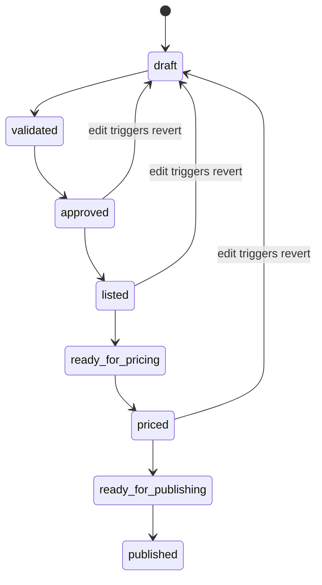

# Custom Index Listing & Pricing Suite - Blueprint

## Modules
- Shared Infra: messaging abstraction (Solace → Kafka swap), logging/metrics/traces, config/secrets, error/envelope model, auth helpers.
- Basket Management: lifecycle, constituents, validation/enrichment, provider statuses, emits listing/pricing/publishing intents.
- Listing Service: provider-specific listing (file/Bloomberg, API/Refinitiv, queue/Internal), fan-out + status events.
- Pricing Service: pricing engines per asset class; market-data/FX adapters with pluggable cache; emits priced events.
- Publishing Service: provider-specific publishing (FIX/BBG, EMA/Refinitiv, Solace/internal), ordered/idempotent delivery.
- Market Data Service: fetch/normalize prices & FX from providers; cache; staleness/SLA enforcement.
- Reference Data Service: golden-source validation; eligibility rules; CA signals; cache with TTL/circuit breakers.

## Tech Stack
- Java 21, Spring Boot (LTS), Spring Data JPA, Spring Cloud Stream (Solace binder now, Kafka-ready), Spring Security (OIDC/JWT).
- Protobuf & gRPC for high-performance internal communication.
- **Abstracted Caching Layer**: Spring Cache with pluggable providers (Redis, Hazelcast, Caffeine).
- MSSQL primary; Postgres-ready schema/migrations (Flyway/Liquibase), HikariCP.
- Packaging: Jib/Buildpacks; RHEL 9+ base (UBI/minimal); runs bare metal or orchestrated.
- Observability: Micrometer/Prometheus, OTel tracing, JSON logs; health/readiness endpoints.
- Caching abstraction: pluggable (Redis/Hazelcast/in-memory) for market/ref data.

## Basket Lifecycle (global)

Per-provider statuses (listing/publishing/pricing) progress independently; edits that revert basket to draft reset provider statuses as needed.

## Domain Model (key fields)
- Basket: id (UUID), name, type (equity/fixed_income/index), status, sourceSystem, preferredMarketDataSources [list], version (opt lock), owner, timestamps.
- Constituent: basketId, instrumentId, instrumentType, weight, quantity, currency, divisor, asOf.
- ProviderStatus: basketId, providerId/name, listingStatus, publishingStatus, pricingStatus, lastError, timestamps.
- AuditEvent: eventId, basketId, actor, action, old/new snapshot refs, timestamp.
- ValidationResult: basketId, status, errors [code, field, message, instrumentId?], warnings.

## OpenAPI (excerpt)
```yaml
openapi: 3.0.3
info: { title: Basket Management API, version: 0.1.0 }
paths:
  /baskets:
    post:
      summary: Create basket draft
      parameters: [{ name: Idempotency-Key, in: header, required: false, schema: { type: string } }]
      requestBody:
        required: true
        content:
          application/json:
            schema: { $ref: '#/components/schemas/BasketCreateRequest' }
      responses:
        '201': { description: created, content: { application/json: { schema: { $ref: '#/components/schemas/Basket' }}}}
  /baskets/{id}/validate:
    post:
      summary: Validate + enrich basket
      responses:
        '200': { description: validation summary, content: { application/json: { schema: { $ref: '#/components/schemas/ValidationResult' }}}}
  /baskets/{id}/approve:
    post: { summary: Approve basket, responses: { '200': { description: ok } } }
  /baskets/{id}/list:
    post: { summary: Mark ready for listing, responses: { '200': { description: ok } } }
  /baskets/{id}/price:
    post: { summary: Mark ready for pricing, responses: { '200': { description: ok } } }
  /baskets/{id}/publish:
    post: { summary: Mark ready for publishing, responses: { '200': { description: ok } } }
  /baskets/{id}/providers:
    get: { summary: Provider statuses, responses: { '200': { description: ok } } }
components:
  schemas:
    BasketCreateRequest:
      type: object
      required: [name, type, sourceSystem]
      properties:
        name: { type: string }
        type: { type: string, enum: [equity, fixed_income, index] }
        sourceSystem: { type: string }
        preferredMarketDataSources: { type: array, items: { type: string } }
        constituents:
          type: array
          items: { $ref: '#/components/schemas/Constituent' }
    Constituent:
      type: object
      required: [instrumentId, weight]
      properties:
        instrumentId: { type: string }
        instrumentType: { type: string }
        weight: { type: number, format: double }
        quantity: { type: number, format: double }
        currency: { type: string }
        divisor: { type: number, format: double }
    Basket:
      allOf:
        - $ref: '#/components/schemas/BasketCreateRequest'
        - type: object
          properties:
            id: { type: string, format: uuid }
            status: { type: string }
            version: { type: integer }
    ValidationResult:
      type: object
      properties:
        status: { type: string, enum: [ok, failed, warning] }
        errors:
          type: array
          items:
            type: object
            properties:
              code: { type: string }
              field: { type: string }
              instrumentId: { type: string }
              message: { type: string }
```

## AsyncAPI (excerpt)
```yaml
asyncapi: 2.6.0
info: { title: Basket Events, version: 0.1.0 }
channels:
  basket.listed: { subscribe: { message: { $ref: '#/components/messages/BasketListed' } } }
  basket.ready_for_pricing: { subscribe: { message: { $ref: '#/components/messages/BasketReadyForPricing' } } }
  basket.priced: { publish: { message: { $ref: '#/components/messages/BasketPriced' } } }
  provider.listing.requested: { publish: { message: { $ref: '#/components/messages/ProviderListingRequested' } } }
  provider.listed: { publish: { message: { $ref: '#/components/messages/ProviderListed' } } }
  provider.listing_failed: { publish: { message: { $ref: '#/components/messages/ProviderListingFailed' } } }
  provider.pricing_completed: { publish: { message: { $ref: '#/components/messages/ProviderPricingCompleted' } } }
  provider.published: { publish: { message: { $ref: '#/components/messages/ProviderPublished' } } }
  provider.publishing_failed: { publish: { message: { $ref: '#/components/messages/ProviderPublishingFailed' } } }
components:
  messages:
    BasketListed:
      payload:
        type: object
        required: [basketId, providers, traceId, occurredAt]
        properties:
          basketId: { type: string, format: uuid }
          providers: { type: array, items: { type: string } }
          traceId: { type: string }
          occurredAt: { type: string, format: date-time }
    BasketReadyForPricing:
      payload:
        type: object
        required: [basketId, traceId, occurredAt]
        properties:
          basketId: { type: string, format: uuid }
          traceId: { type: string }
          occurredAt: { type: string, format: date-time }
    BasketPriced:
      payload:
        type: object
        required: [basketId, nav, asOf, pricingSources, traceId]
        properties:
          basketId: { type: string, format: uuid }
          nav: { type: number, format: double }
          asOf: { type: string, format: date-time }
          pricingSources: { type: array, items: { type: string } }
          traceId: { type: string }
    ProviderListingRequested:
      payload:
        type: object
        required: [basketId, providerId, traceId, occurredAt]
        properties:
          basketId: { type: string, format: uuid }
          providerId: { type: string }
          traceId: { type: string }
          occurredAt: { type: string, format: date-time }
    ProviderListed:
      payload:
        type: object
        required: [basketId, providerId, occurredAt, traceId]
        properties:
          basketId: { type: string, format: uuid }
          providerId: { type: string }
          occurredAt: { type: string, format: date-time }
          traceId: { type: string }
    ProviderListingFailed:
      payload:
        type: object
        required: [basketId, providerId, errorCode, message, traceId]
        properties:
          basketId: { type: string, format: uuid }
          providerId: { type: string }
          errorCode: { type: string }
          message: { type: string }
          traceId: { type: string }
    ProviderPricingCompleted:
      payload:
        type: object
        required: [basketId, providerId, asOf, traceId]
        properties:
          basketId: { type: string, format: uuid }
          providerId: { type: string }
          asOf: { type: string, format: date-time }
          traceId: { type: string }
    ProviderPublished:
      payload:
        type: object
        required: [basketId, providerId, occurredAt, traceId]
        properties:
          basketId: { type: string, format: uuid }
          providerId: { type: string }
          occurredAt: { type: string, format: date-time }
          traceId: { type: string }
    ProviderPublishingFailed:
      payload:
        type: object
        required: [basketId, providerId, errorCode, message, traceId]
        properties:
          basketId: { type: string, format: uuid }
          providerId: { type: string }
          errorCode: { type: string }
          message: { type: string }
          traceId: { type: string }

## Validation & Data Quality Rules
- Instruments: exists in ref data; active/not suspended; correct asset class; tradable venue; currency allowed.
- Constituents: no duplicates; weights/quantities non-negative; weight sum within tolerance; per-constituent/sector/country caps; min count; divisor required when configured.
- Corporate actions: detect splits/dividends/delistings; effective-dated checks.
- Market data readiness: each instrument has a priceable source; staleness thresholds; FX path available.
- **Pricing Data Quality (Pre-Pricing/Post-Pricing):**
    - Staleness detection (price age vs threshold).
    - Variance checks (current price vs last/moving average).
    - Zero/negative price detection.
    - Missing FX rate validation.
- **Publishing Data Quality (Pre-Publishing):**
    - Integrity checks (all constituents priced).
    - Format validation (provider-specific requirements).
    - Sanity checks (NAV within expected range).
- Workflow guards: edits after approved+ revert to draft; provider statuses reset on revert.
- Error reporting: structured codes per field/instrument; partial success for bulk.

## Messaging Abstraction
- Use Spring Cloud Stream bindings; profiles: `solace` (default), `kafka` (future).
- Serialization: Support JSON (default) and Protobuf for high-performance inter-service communication.
- Envelope: `{traceId, idempotencyKey, schemaVersion, payload}`; partition key `basketId`.
- Reliability: retries/backoff, DLQ, idempotent consumers; sequence/version to avoid stale overwrites.

## Database Sketch (portable MSSQL/Postgres)
- Tables: `basket`, `constituent`, `provider_status`, `audit_event`, `validation_result`.
- Types: use `uuid`/`uniqueidentifier`, `varchar`, `numeric(18,6)` for decimals; timestamps as `timestamptz`/`datetimeoffset`.
- Indexing: by `basket_id`, `provider_id`, `status`; composite on `(basket_id, provider_id)`.
- Migrations: Flyway/Liquibase with vendor-neutral DDL; conditional extensions for Postgres (`uuid-ossp`) gated by profile.

## Deployment & Ops
- Images: UBI minimal; non-root user; read-only FS where possible.
- Config: externalized via env/Config Server; secrets via vault/KMS.
- Health: liveness/readiness; startup gate on DB connectivity (optional).
- Observability: Prometheus scrape, OTel exporter, JSON logs; dashboards for latency/success, DLQ depth, staleness.
- Scalability: partitioned consumers on `basketId`; horizontal scaling with bounded concurrency per provider adapter.
